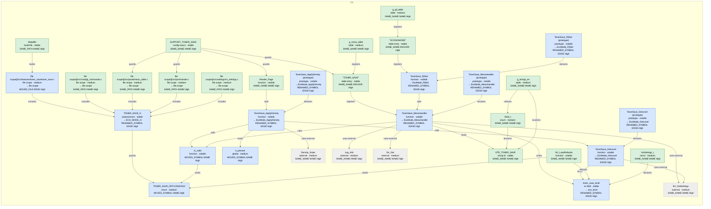

```mermaid
flowchart LR
    subgraph C1["C1"]
        N001["SUPPORT_TONER_SAVE<br/>config-macro · stable<br/>SAME_NAME NAME High"]:::same
        N002["Makefile<br/>build-file · stable<br/>SAME_PATH NAME High"]:::same
        N003["TONER_SAVE_H<br/>preprocessor · stable<br/>→ ECO_MODE_H<br/>RENAMED_SYMBOL EDGE High"]:::renamed
        N004["TONER_SAVE_OFF/LOW/HIGH<br/>enum · medium<br/>MOVED_SYMBOL NAME High"]:::renamed
        N005["k_percent<br/>global · medium<br/>MOVED_SYMBOL NAME High"]:::renamed
        N006["is_valid<br/>function · volatile<br/>MOVED_SYMBOL NAME High"]:::renamed
        N007["TonerSave_GetLevel<br/>function · volatile<br/>→ EcoMode_GetLevel<br/>RENAMED_SYMBOL EDGE High"]:::renamed
        N008["TonerSave_ApplyDensity<br/>function · volatile<br/>→ EcoMode_ApplyDensity<br/>RENAMED_SYMBOL EDGE High"]:::renamed
        N009["TonerSave_MenuHandler<br/>function · volatile<br/>→ EcoMode_MenuHandler<br/>RENAMED_SYMBOL EDGE High"]:::renamed
        N010["TonerSave_PjlSet<br/>function · volatile<br/>→ EcoMode_PjlSet<br/>RENAMED_SYMBOL EDGE High"]:::renamed
        N011["g_pjl_table<br/>table · medium<br/>SAME_NAME NAME High"]:::same
        N012["#quot;ECONOMODE#quot;<br/>table-entry · stable<br/>SAME_NAME ANCHOR High"]:::same
        N013["g_menu_table<br/>table · medium<br/>SAME_NAME NAME High"]:::same
        N014["#quot;TONER_SAVE#quot;<br/>table-entry · stable<br/>SAME_NAME ANCHOR High"]:::same
        N015["Render_Page<br/>function · volatile<br/>SAME_NAME NAME High"]:::same
        N016["StrId_t<br/>enum · medium<br/>SAME_NAME NAME High"]:::same
        N017["STR_TONER_SAVE<br/>string-id · stable<br/>SAME_NAME NAME High"]:::same
        N018["g_strings_en<br/>table · medium<br/>SAME_NAME NAME High"]:::same
        N019["NvSettings_t<br/>struct · medium<br/>SAME_NAME NAME High"]:::same
        N020["toner_save_level<br/>nv-field · stable<br/>→ eco_level<br/>RENAMED_SYMBOL EDGE High"]:::renamed
        N021["NV_LoadDefaults<br/>function · volatile<br/>SAME_NAME NAME High"]:::same
        N022["file scope@src/cmd/pjl_commands.c<br/>file scope · medium<br/>→ file-scope<br/>SAME_PATH NAME High"]:::same
        N023["file scope@src/features/toner_save/toner_save.c<br/>file scope · medium<br/>→ file-scope<br/>MOVED_FILE EDGE High"]:::renamed
        N024["file scope@src/panel/menu_table.c<br/>file scope · medium<br/>→ file-scope<br/>SAME_PATH NAME High"]:::same
        N025["file scope@src/print/render.c<br/>file scope · medium<br/>→ file-scope<br/>SAME_PATH NAME High"]:::same
        N026["file scope@src/settings/nv_settings.c<br/>file scope · medium<br/>→ file-scope<br/>SAME_PATH NAME High"]:::same
        N027["TonerSave_GetLevel (prototype)<br/>prototype · volatile<br/>→ EcoMode_GetLevel<br/>RENAMED_SYMBOL EDGE High"]:::renamed
        N028["TonerSave_ApplyDensity (prototype)<br/>prototype · volatile<br/>→ EcoMode_ApplyDensity<br/>RENAMED_SYMBOL EDGE High"]:::renamed
        N029["TonerSave_MenuHandler (prototype)<br/>prototype · volatile<br/>→ EcoMode_MenuHandler<br/>RENAMED_SYMBOL EDGE High"]:::renamed
        N030["TonerSave_PjlSet (prototype)<br/>prototype · volatile<br/>→ EcoMode_PjlSet<br/>RENAMED_SYMBOL EDGE High"]:::renamed
        N031["NV_GetSettings<br/>external · medium<br/>SAME_NAME NAME High"]:::external
        N032["Density_Scale<br/>external · medium<br/>SAME_NAME NAME High"]:::external
        N033["Log_Info<br/>external · medium<br/>SAME_NAME NAME High"]:::external
        N034["Str_Get<br/>external · medium<br/>SAME_NAME NAME High"]:::external
    end
    N002 -->|builds| N023
    N023 -->|includes| N003
    N022 -->|includes| N003
    N024 -->|includes| N003
    N025 -->|includes| N003
    N026 -->|includes| N003
    N001 -->|guards| N024
    N001 -->|guards| N014
    N001 -->|guards| N025
    N001 -->|guards| N015
    N003 -->|guards| N004
    N011 -->|registers| N012
    N012 -->|registers| N010
    N013 -->|registers| N014
    N014 -->|registers| N009
    N015 -->|calls| N008
    N008 -->|calls| N007
    N008 -->|calls| N006
    N008 -->|reads| N005
    N008 -->|uses-external| N032
    N009 -->|calls| N006
    N009 -->|writes| N020
    N009 -->|uses-external| N031
    N009 -->|uses-external| N033
    N009 -->|uses-external| N034
    N009 -->|reads| N017
    N010 -->|calls| N009
    N007 -->|reads| N020
    N007 -->|uses-external| N031
    N006 -->|reads| N004
    N021 -->|defaults| N020
    N021 -->|reads| N004
    N019 -->|declares| N020
    N016 -->|declares| N017
    N018 -->|localizes| N017
    N018 -->|indexes| N016
    N027 -->|declares| N007
    N028 -->|declares| N008
    N029 -->|declares| N009
    N030 -->|declares| N010
    classDef stable fill:#d8f0dc,stroke:#2e7d32,color:#000
    classDef medium fill:#fff4cc,stroke:#b8860b,color:#000
    classDef volatile fill:#ffe0cc,stroke:#c85a00,color:#000
    classDef external fill:#eeeeee,stroke:#888888,color:#000,stroke-dasharray:4 3
    classDef same fill:#d8f0dc,stroke:#2e7d32,color:#000
    classDef renamed fill:#d6e6ff,stroke:#1f5fbf,color:#000
    classDef splitmerge fill:#ead9ff,stroke:#6a3fb5,color:#000
    classDef lowconf fill:#ffe0cc,stroke:#c85a00,color:#000,stroke-width:3px
    classDef missing fill:#ffd6d6,stroke:#c62828,color:#000,stroke-width:3px
    classDef open fill:#ffffff,stroke:#888888,color:#000
```

Legend: green = name kept · blue = renamed/moved · purple = split/merged · orange = Low confidence · red = not found/rewritten/removed · white = not anchored · grey dashed = outside the request
